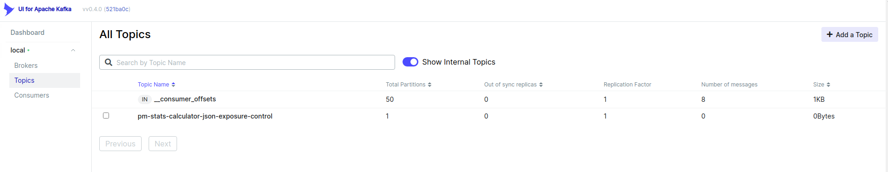

# Query Service Developers Guide

<!-- TOC -->
* [Query Service Developers Guide](#query-service-developers-guide)
  * [Revision History](#revision-history)
  * [Introduction](#introduction)
  * [Interfaces](#interfaces)
    * [Kafka Interface](#kafka-interface)
  * [REST API](#rest-api)
    * [API endpoints](#api-endpoints)
    * [Get the model of a schema](#get-the-model-of-a-schema)
    * [Query the contents of a schema](#query-the-contents-of-a-schema)
  * [Features](#features)
    * [Implemented OData features:](#implemented-odata-features-)
    * [Not implemented OData features:](#not-implemented-odata-features-)
  * [Usage](#usage)
      * [Exposing schemas/entities:](#exposing-schemasentities-)
<!-- TOC -->

## Revision History

| Date       | Revision | Comment                                                        | Author        |
|------------|----------|----------------------------------------------------------------|---------------|
| 23/06/2022 | 1.0.0    | Initial Version                                                | Jurij SVEC JS |
| 29/08/2023 | 1.0.1    | Fix Deployment - Configuration parameters chapter              | Alex Ajtai    |
| 24/11/2023 | 1.1.0    | Tidying the guide                                              | Tibor Illes   |
| 24/11/2023 | 1.1.1    | Adding clarification about the dynamic API in REST API chapter | Tibor Illes   |

## Introduction

Query Service is a stateless microservice based on the Spring Boot Chassis. This service exposes data from a PostgreSQL database via OData (V4) queries.

This service provides a REST API interface for rApps with multiple DB schema handling.

The microservice include the following functions:

- Application use the Kafka topic notification, which is indicates that the DB schema has been modified.

- Application reads the schema from Postgres DB

- Application provides DB content and metadata through the OData service

It also offers interfaces for checking health status and expose metrics through Prometheus endpoints.

## Interfaces

### Kafka Interface

The application uses Kafka topic to expose schemas. At startup the microservice subscibes to pm-stats-calculator-json-exposure-control topic and read messages.

The following Kafka UI interface are supported to manage this messages.

UI for Kafka help us to create and browse topics.

We can pass own parameters via **Messages** view.

**Topic**: The pm-stats-calculator-json-exposure-control topic for the indication of schemas exposure

**Key**: This value must be the name of the schema

**Content**: The content value contains the exposed schema tables.

## REST API

Query Service provides a dynamic REST API based on ODATA to query the underlying data.
For more information about ODATA, see https://www.odata.org/documentation/.
Only GET operations are supported, there is no way to manipulate the exposed data.
For a detailed guide to building an ODATA client, see https://olingo.apache.org/doc/odata4/tutorials/od4_basic_client_read.html

> **WARNING**: As the service does not provide traditional static URLs, the OAS file is only for demonstration purposes for typical PMSCH use cases. No client or business logic should be based on top of the OAS file.

### API endpoints

The API has a base URL of _/kpi-handling/exposure/_, all endpoints use this prefix. After this prefix, the clients must provide the api version (initial version: _/v1/_), then the name of the used database schema in the URL.

### Get the model of a schema

<table class="wrapped confluenceTable" style="text-align: left;"><colgroup><col></colgroup><tbody style="text-align: left;"><tr style="text-align: left;"><td style="text-align: left;" class="confluenceTd">
<code class="text plain" style="text-align: left;">http://&lt;query-service&gt;/kpi-handling/exposure/v1/&lt;schema-name&gt;/$metadata</code>
</td></tr></tbody></table>

This endpoint returns the response in XML format by default, but we can override it with the $format query parameter ("xml" or "json" value).
**Metadata example response** Expand source

### Query the contents of a schema

<table class="wrapped confluenceTable" style="text-align: left;"><colgroup><col></colgroup><tbody style="text-align: left;"><tr style="text-align: left;"><td style="text-align: left;" class="confluenceTd">
<code class="text plain" style="text-align: left;">http://&lt;query-service&gt;/kpi-handling/exposure/v1/&lt;schema-name&gt;/&lt;entity-type&gt;</code>
</td></tr></tbody></table>

This API endpoint lists the entires of the given entity type. Entity types can be fetched from the metadata endpoint mentioned above. The endpoint accepts optional query parameters from [the supported OData features](https://confluence-oss.seli.wh.rnd.internal.ericsson.com/display/IDUN/PM+Stats+Query+Service+Documentation#PMStatsQueryServiceDocumentation-ImplementedODatafeatures:). The response format is JSON by default.

Examples:

*   [http://queryservice:8080/kpi-handling/exposure/v1/public_schema/$metadata](http://queryservice:8080/kpi-handling/exposure/v1/public_schema/$metadata)
*   [http://queryservice:8080/kpi-handling/exposure/v1/public_schema/test_data?$orderby=date%20desc&$top=50&$skip=150&count=true&$format=xml&$select=first%2Csecond&$filter=first%20lt%20927](http://queryservice:8080/kpi-handling/exposure/v1/public_schema/test_data?$orderby=date%20desc&$top=50&$skip=150&count=true&$format=xml&$select=first%2Csecond&$filter=first%20lt%20927)

## Features

### Implemented OData features:

*   [$select](http://docs.oasis-open.org/odata/odata/v4.01/odata-v4.01-part2-url-conventions.html#sec_SystemQueryOptionselect): The $select system query option allows clients to request a specific set of properties for each entity or complex type.
*   [$orderby](http://docs.oasis-open.org/odata/odata/v4.01/odata-v4.01-part2-url-conventions.html#sec_SystemQueryOptionorderby): The $orderby system query option allows clients to request resources in a particular order.
*   [$top and $skip](http://docs.oasis-open.org/odata/odata/v4.01/odata-v4.01-part2-url-conventions.html#sec_SystemQueryOptionstopandskip): The $top system query option requests the number of items in the queried collection to be included in the result. The $skip query option requests the number of items in the queried collection that are to be skipped and not included in the result. A client can request a particular page of items by combining $top and $skip.
*   [$count](http://docs.oasis-open.org/odata/odata/v4.01/odata-v4.01-part2-url-conventions.html#sec_SystemQueryOptioncount): The $count system query option allows clients to request a count of the matching resources included with the resources in the response.
*   [$filter](http://docs.oasis-open.org/odata/odata/v4.01/odata-v4.01-part2-url-conventions.html#sec_SystemQueryOptionfilter): The $filter system query option allows clients to filter a collection of resources that are addressed by a request URL. The expression specified with $filter is evaluated for each resource in the collection, and only items where the expression evaluates to true are included in the response.
*   [$format](http://docs.oasis-open.org/odata/odata/v4.01/odata-v4.01-part2-url-conventions.html#sec_SystemQueryOptionformat): The $format system query option allows clients to request a response in a particular format and is useful for clients without access to request headers for standard content-type negotiation.

#### OData system query option examples

| OData system query option | Example URL                                    |
|---------------------------|------------------------------------------------|
| select                    | GET /first_table?$select=first_kpi             |
| orderby                   | GET /first_table?$orderby=date_time desc       |
| top                       | GET /first_table?$top=2                        |
| skip                      | GET /first_table?$skip=2                       |
| count                     | GET /first_table?$count=true                   |
| filter                    | GET /first_table?$filter=first_kpi lt 0        |

#### Result set limitations

The size of the result set has an upper bound as defined in the `max-record-count` application property.

### Not implemented OData features:

*   [$search](http://docs.oasis-open.org/odata/odata/v4.01/odata-v4.01-part2-url-conventions.html#sec_SystemQueryOptionsearch): The $search system query option allows clients to request items within a collection matching a free-text search expression.
*   [$expand](http://docs.oasis-open.org/odata/odata/v4.01/odata-v4.01-part2-url-conventions.html#sec_SystemQueryOptionexpand): The $expand system query option specifies the related resources or media streams to be included in line with retrieved resources.
*   [$compute](http://docs.oasis-open.org/odata/odata/v4.01/odata-v4.01-part2-url-conventions.html#sec_SystemQueryOptioncompute): The $compute system query option allows clients to define computed properties that can be used in a $select or within a $filter or $orderby expression.
*   [$index](http://docs.oasis-open.org/odata/odata/v4.01/odata-v4.01-part2-url-conventions.html#sec_SystemQueryOptionindex): The $index system query option allows clients to do a positional insert into a collection annotated with using the Core.PositionalInsert term.
*   [$schemaversion](http://docs.oasis-open.org/odata/odata/v4.01/odata-v4.01-part2-url-conventions.html#sec_SystemQueryOptionschemaversion): The $schemaversion system query option allows clients to specify the version of the schema against which the request is made.
*   [Parameter Aliases](http://docs.oasis-open.org/odata/odata/v4.01/odata-v4.01-part2-url-conventions.html#sec_ParameterAliases): Parameter aliases can be used in place of literal values in entity keys, function parameters, or within a $filter or $orderby expression.

### Usage

#### Exposing schemas/entities:

*   **Exposing a new schema:** Send a message to the topic with the schema name as the key. The value of the message is JSON of the following form:

{

“timestamp”: 1642775672,
“exposure”: \[
{ “name”: “tablename”,
“kind”: “table”
},
{ “name”: “viewname”,
“kind”: “view”
},
...
\]
}

The allowed values of the “kind” field are “table” and “view”. The timestamp is used to track when the configuration belonging to a schema last changed.

*   **Modifying the exposure of an already exposed schema or notification about a schema change:** Same as adding a new schema. Since the same schema name is used again as the key, the Kafka compaction mechanism will remove the original configuration for this schema.
*   **Hiding an exposed schema:** Send a message to the topic with the schema name as the key. The value of the message must be null.
