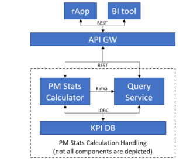

# PM Stats Query Service User Guide

- [PM Stats Query Service User Guide](#pm-stats-query-service-user-guide)
    - [Overview](#overview)
        - [Revision History](#revision-history)
        - [Maturing Features](#maturing-features)
        - [Architecture](#architecture)
    - [Deployment](#deployment)
        - [Prerequisites](#prerequisites-prereq-1)
        - [Deployment in a Kubernetes Environment Using Helm](#deployment-in-a-kubernetes-environment-using-helm)
        - [Configuration Parameters](#configuration-parameters)
        - [Service Dimensioning](#service-dimensioning)
        - [Hardening](#hardening)
        - [Upgrade Procedures](#upgrade-procedures)
        - [Security Guidelines](#security-guidelines)
        - [Privacy User Guidelines](#privacy-user-guidelines)
    - [Operation and Maintenance](#operation-and-maintenance)
        - [Metrics](#metrics)
        - [Backup and Restore](#backup-and-restore)
    - [Troubleshooting](#troubleshooting)
        - [Prerequisites](#prerequisites-prereq-2)
        - [Health Checks](#health-checks)
        - [Installation](#installation)
        - [Logs](#logs)
        - [Deletion of Release](#deletion-of-release)
        - [Bug Reporting and Additional Support](#deletion-of-release)
        - [Recovery Procedure](#recovery-procedure)
        - [Possible Issues](#possible-issues)
    - [References](#references)

## Overview

This document provides an overview of the Query Service. It gives a brief description of its main features and its interfaces.


### Revision History

| Date       | Revision | Comment                                                      | Author          |
|------------|----------|--------------------------------------------------------------|-----------------|
| 23/06/2022 | 1.0.0    | Initial Version                                              | Ocsai Bernadett |
| 22/08/2023 | 1.1.0    | Fix Overview chapter                                         | Eva Molnarka    |
| 29/08/2023 | 1.1.1    | Fix Deployment - Configuration parameters chapter            | Alex Ajtai      |
| 30/08/2023 | 1.1.2    | Fix Deployment chapter                                       | Alex Ajtai      |
| 30/08/2023 | 1.1.3    | Fix Operation and Maintenance chapter                        | Alex Ajtai      |
| 30/08/2023 | 1.1.4    | Fix Security Guidelines and Privacy User Guidelines chapters | Alex Ajtai      |
| 30/08/2023 | 1.1.5    | Fix Troubleshooting and References chapters                  | Alex Ajtai      |
| 01/09/2023 | 1.1.6    | API URL change                                               | Zoltan Nemeth   |
| 24/11/2023 | 1.1.7    | Expanding the Troubleshooting chapter                        | Tibor Illes     |

### Maturing Features

There are no Alpha/Beta features included in the release.

### Architecture

Query Service is a stateless microservice based on the Spring Boot Chassis. This service exposes data from a PostgreSQL database via OData (V4) queries.

This service provides a REST API interface for rApps with multiple DB schema handling.

The microservice includes the following functions:

- Application reads the schema from Postgres DB

- Application provides DB content and metadata through the OData service

It also offers interfaces for checking health status and expose metrics through Prometheus endpoints.




#### Application Programming Interfaces (APIs)

This chapter gives an overview of included APIs.

PM Stats Query Service provides the following REST API to query the database schema and the database entities.

| API                                                                   | API Summary                                      |
|-----------------------------------------------------------------------|--------------------------------------------------|
| GET /kpi-handling/exposure/v1/&lt;schema-name&gt;/$metadata           | Get the model of a schema                        |
| GET /kpi-handling/exposure/v1/&lt;schema-name&gt;/&lt;entity-type&gt; | Query the contents of a schema                   |

For more information about API usage and examples, see the Application Developers Guide.

## Deployment

PM Stats Query Service is packaged as a docker image and can be deployed in a Kubernetes environment by HELM chart. Deployment instructions below contain steps to get started using the service in supported environments. It also specifies different configuration options that can be used when starting the service.

If there is any problem with the deployment, refer to Troubleshooting.

### Prerequisites {#prereq-1}

* a running Kubernetes environment with helm support
* a Postgres deployment running in the same namespace (see Document Database PG)

### Deployment in a Kubernetes Environment Using Helm

This section describes how to deploy the service in Kubernetes using Helm and
the `kubectl` CLI client. Helm is a package manager for Kubernetes that
streamlines the installation and management of Kubernetes applications.

#### Preparation

Prepare helm chart and docker images. Helm chart in the following link
can be used for installation:

[Helm Chart Package](https://arm.seli.gic.ericsson.se/artifactory/proj-eric-oss-drop-helm/eric-oss-pm-stats-query-service/)

#### Pre-Deployment Checks for PM Stats Query Service

Ensure the following:

- The release name is not used already in the corresponding cluster.
  Use `helm list -n <namespace>` command to list the existing deployments (and delete previous
  deployment with the corresponding release name if needed).

- The same namespace is used for all deployments.

- A secret containing Armdocker registry login credentials exists.

- A secret named eric-oss-pm-stats-calculator-kpi-data containing postgres database login credentials exists.

- Postgres DB and Kafka are installed in the same namespace.

#### Helm Chart Installations of Dependent Services

- Install Strimzi Kafka - Please refer to [Strimzi Kafka Service User Guide's Deployment Section](https://adp.ericsson.se/marketplace/kf-operator-sz/documentation/1.1.0-31/dpi/service-user-guide#strimziuserguide-deploymentview)

- Install PostgreSQL - Please refer to [PostgreSQL User Guide's Deployment Section](https://adp.ericsson.se/marketplace/document-database-pg/documentation/8.13.0/dpi/service-user-guide#deployment)

- Install PM Stats Calculator - Please refer to [Install PM Stats Calculator's Service User Guide's Deployment Section](https://adp.ericsson.se/marketplace/pm-stats-calculator/documentation/1.185.0-1/dpi/service-user-guide#deployment)

#### Create SIP-TLS certificate with PM Stats Query Service's InternalUserCA

When communication between services is set to TLS, an InternalCertificate needs to be created.

For details about how to create a certificate, please refer to SIP-TLS documents on [marketplace](https://adp.ericsson.se/marketplace/service-identity-provider-tls).

Example of a certificate(SIP-TLS CR) with PM Stats Query Service's InternalUserCA

~~~yaml
apiVersion: siptls.sec.ericsson.com/v1alpha1
kind: InternalCertificate
metadata:
 name: example
spec:
 kubernetes:
  generatedSecretName: example
  certificateName: clicert.pem
  privateKeyName: cliprivkey.pem
 certificate:
  subject:
   cn: <Client-Microservice-Name>
  issuer:
   reference: eric-oss-pm-stats-query-service-ca
  extendedKeyUsage:
   tlsClientAuth: true
   tlsServerAuth: false
~~~

PM Stats Query Service's InternalUserCA is named: *eric-oss-pm-stats-query-service-ca*

>**_Note:_** If fullNameOverride helm value is changed, the name of the CA will also reflect that.
> For example, if the fullNameOverride is "*query-service*", the CA will be named "*query-service-ca*"

#### Helm Chart Installation of PM Stats Query Service

>**_Note:_** Ensure all dependent services are deployed and healthy before you
>continue with this step (see previous chapter).

Helm is a tool that streamlines installing and managing Kubernetes
applications. PM Stats Query Service can be deployed on Kubernetes using
Helm Charts. Charts are packages of pre-configured Kubernetes resources.

Users can override the default values provided in the values.yaml template of
the helm chart. The recommended parameters to override are listed in the
following section: [Configuration Parameters](#configuration-parameters).

##### Deploy the PM Stats Query Service

- *deployment with mandatory parameters only;*
- *deployment with some optional parameters.*

Install the PM Stats Query Service on the Kubernetes cluster by using the
helm installation command:

```text
helm install <CHART_REFERENCE> --name <RELEASE_NAME> --namespace <NAMESPACE> --set imageCredentials.pullSecret=<ARMDOCKER_SECRET>,<other_optional_parameters>
```

The variables specified in the command are as follows:

- `<CHART_REFERENCE>`: A path to a packaged chart, a path to an unpacked chart
  directory or a URL.

- `<RELEASE_NAME>`: String value, a name to identify and manage your helm chart.

- `<NAMESPACE>`: String value, a name to be used dedicated by the user for
  deploying own helm charts.

- `<ARMDOCKER_SECRET>`: String value, the name of the secret containing the armdocker login credentials.

###### Examples

Install the PM Stats Query Service with mandatory config values.

```text
helm install <CHART_REFERENCE> --name <RELEASE_NAME> --namespace <NAMESPACE> --set imageCredentials.pullSecret=<ARMDOCKER_SECRET>,<other_optional_parameters>
```

##### Verify the PM Stats Query Service Availability

To verify whether the deployment is successful, do as follows:

1.  Check if the chart is installed with the provided release name and
    in related namespace by using the following command:

```text
$helm ls -n <namespace>
```

Chart status should be reported as "DEPLOYED".

2.  Verify the status of the deployed helm chart.

```text
$helm status -n <namespace> <release_name>
```

Chart status should be reported as "DEPLOYED". All Pods status should be
reported as "Running" and number of Deployment Available should be the
same as the replica count.

3.  Verify that the pods are running
    by getting the status for your pods.

```text
$kubectl get pods --namespace=<namespace> -L role
```

For example:

```text
$helm ls -n example
$helm status -n example examplerelease
$kubectl get pods --namespace=example -L role
```

All pods status should be "Running". All containers in any pod should
be reported as "Ready".

### Configuration Parameters

#### Mandatory Configuration Parameters

| Variable Name                                                             | Description                                                                                                                                                                                                           | Default Value                                                          |
|---------------------------------------------------------------------------|-----------------------------------------------------------------------------------------------------------------------------------------------------------------------------------------------------------------------|------------------------------------------------------------------------|
| imageCredentials.eric-oss-pm-stats-query-service.pullSecret               | String value, name of the secret containing the login credentials to the Armdocker registry. Secret must be manually created in the namespace, no default value is provided.                                          |                                                                        |


#### Optional Configuration Parameters

| Variable Name                                                                    | Description                                                                                                                                                                                                                                                                                                          | Default Value                                                          |
|----------------------------------------------------------------------------------|----------------------------------------------------------------------------------------------------------------------------------------------------------------------------------------------------------------------------------------------------------------------------------------------------------------------|------------------------------------------------------------------------|
| affinity.podAntiAffinity                                                         | String value, set pod anti-affinity scheduling rules. Valid values are "soft" or "hard". "hard" indicates that pods must be scheduled on different nodes. "soft" is the preferred way. When the number of Pods is greater than the number of available nodes, "hard" may cause Pods to be in an unschedulable state. | "soft"                                                                 |
| affinity.topologyKey                                                             | String value, determines the topology key to use as the failure domain                                                                                                                                                                                                                                               | "kubernetes.io/hostname"                                               |
| annotations                                                                      | Annotations is a map of key-value pairs which allows users to add custom annotations to the existing list. For example, --set annotations.infoKey1=value1,annotations.infoKey2=value2                                                                                                                                | {}                                                                     |
| appArmorProfile.type                                                             | String value, app armor profile setting. This value should be set to "unconfined" when deploying on a local environment on a windows machine                                                                                                                                                                         | ""                                                                     |
| autoScaling.enabled                                                              | Boolean value, determines whether autoscaling is enabled or not                                                                                                                                                                                                                                                      | false                                                                  |
| autoScaling.maxReplicas                                                          | Integer value, determines the default maximum replicas of the pod                                                                                                                                                                                                                                                    | 100                                                                    |
| autoScaling.minReplicas                                                          | Integer value, determines the default minimum replicas of the pod                                                                                                                                                                                                                                                    | 1                                                                      |
| autoScaling.targetCPUUtilizationPercentage                                       | Integer value, determines the default target CPU utilization percentage                                                                                                                                                                                                                                              | 80                                                                     |
| cnomServer.enabled                                                               | Boolean value, determines whether CNOM auto-discovery is enabled or not                                                                                                                                                                                                                                              | true                                                                   |
| dst.collector.host                                                               | String value, sets the host for DST collector                                                                                                                                                                                                                                                                        | "http://eric-dst-collector"                                            |
| dst.collector.portJaegerGrpc                                                     | Integer value, sets the port for Jaeger using GRPC                                                                                                                                                                                                                                                                   | 14250                                                                  |
| dst.collector.portOtlpGrpc                                                       | Integer value, sets the port for DST collector when using GRPC                                                                                                                                                                                                                                                       | 4317                                                                   |
| dst.collector.portOtlpHttp                                                       | Integer value, sets the port for DST collector when using HTTP                                                                                                                                                                                                                                                       | 4318                                                                   |
| dst.collector.protocol                                                           | String value, sets the protocol for DST collector. Valid values are "http" or "grpc"                                                                                                                                                                                                                                 | "http"                                                                 |
| dst.enabled                                                                      | Boolean value, determines whether tracing is enabled or not                                                                                                                                                                                                                                                          | true                                                                   |
| dst.producer.type                                                                | String value, sets the producer type for DST. Valid values are "B3" or "W3C" or "B3,W3C"                                                                                                                                                                                                                             | "B3"                                                                   |
| eric-pm-server.rbac.appMonitoring.enabled                                        | Boolean value, determines whether monitoring is enabled for eric-pm-server                                                                                                                                                                                                                                           | true                                                                   |
| flyway.enabled                                                                   | Boolean value, If set to true, Flyway is used to run migration scripts to insert some test data into the database                                                                                                                                                                                                    | false                                                                  |
| fullnameOverride                                                                 | String value, determines the full overridden name of the microservice                                                                                                                                                                                                                                                | ""                                                                     |
| imageCredentials.eric-oss-pm-stats-query-service.registry                        | Overrides global registry url                                                                                                                                                                                                                                                                                        | nil                                                                    |
| imageCredentials.eric-oss-pm-stats-query-service.repoPath                        | String value, Docker repository path                                                                                                                                                                                                                                                                                 | "REPOPATH"                                                             |
| imagePullSecrets                                                                 | List value, determines the list of the image pull secrets                                                                                                                                                                                                                                                            | []                                                                     |
| labels                                                                           | Empty labels list for application deployment engineer to add more labels                                                                                                                                                                                                                                             | nil                                                                    |
| lifecycle.preStop.command                                                        | shell command String value, checks if the prestop of the lifecycle works                                                                                                                                                                                                                                             | "['/bin/sh', '-c', 'echo PreStop works']"                              |
| log.logControlFile                                                               | String value, determines the default log control file location                                                                                                                                                                                                                                                       | "/logcontrol/logcontrol.json"                                          |
| log.logLevel                                                                     | String value, determines the default log level                                                                                                                                                                                                                                                                       | "INFO"                                                                 |
| log.streamingMethod                                                              | String value, determines the log streaming method. The default value is determined by global.log.streamingMethod.                                                                                                                                                                                                    |                                                                        |
| nameOverride                                                                     | String value, determines the overridden name of the microservice                                                                                                                                                                                                                                                     | ""                                                                     |
| nodeSelector                                                                     | nodeSelector is a map of key-value pairs to schedule pods on labeled nodes. For example use label disktype=ssd to assign pods to nodes with this label                                                                                                                                                               | {}                                                                     |
| osm2ism.enabled                                                                  | Boolean value, determines whether outside Service Mesh to inside Service Mesh is enabled for PM Stats Query                                                                                                                                                                                                          | false                                                                  |
| osm2ism.outMeshServices.cnom.enabled                                             | Boolean value, determines whether outside Service Mesh to inside Service Mesh is enabled for CNOM to PM Stats Query                                                                                                                                                                                                  | false                                                                  |
| osm2ism.outMeshServices.cnom.name                                                | String Value, the name used for generating the certificate resources for CNOM                                                                                                                                                                                                                                        | ""                                                                     |
| osm2ism.outMeshServices.cnom.intermediateCA.enabled                              | Boolean value, determines whether an issuer reference is enabled for the out of mesh service CNOM                                                                                                                                                                                                                    | false                                                                  |
| osm2ism.outMeshServices.cnom.intermediateCA.name                                 | String value, the name of the CA issuer used by CNOM                                                                                                                                                                                                                                                                 | ""                                                                     |
| podAnnotations                                                                   | Set value, determines the set of the default pod annotations of the microservice                                                                                                                                                                                                                                     | {}                                                                     |
| podDisruptionBudget.minAvailable                                                 | Integer value or percentage, the number of pods that must still be available after the eviction, only one of this or podDisruptionBudget.maxUnavailable can be in effect at a time. If both are set this takes precedence.                                                                                           | 1                                                                      |
| podDisruptionBudget.maxUnavailable                                               | Integer value or percentage, the maximum number of pods that can be evicted, only one of this or podDisruptionBudget.minAvailable can be in effect at a time. If both are set podDisruptionBudget.minAvailable takes precedence.                                                                                     | ""                                                                     |
| podPriority.eric-oss-pm-stats-query-service.priorityClassName                    | String value, priorityClass name for pod priority. The pod priority will be resolved to value according to the existing priority class. The higher the value, the higher the priority. The pod priority is zero when priorityClassName not set                                                                       | ""                                                                     |
| podSecurityContext.supplementalGroups                                            | Integer value, determines the default value of pod security supplemental groups                                                                                                                                                                                                                                      | null                                                                   |
| probes.eric-oss-pm-stats-query-service.livenessProbe.failureThreshold            | Integer value, sets the default value of the failure threshold of the liveness probe                                                                                                                                                                                                                                 | 3                                                                      |
| probes.eric-oss-pm-stats-query-service.livenessProbe.initialDelaySeconds         | Integer value, sets the amount of time it takes to start the liveness probe                                                                                                                                                                                                                                          | 60                                                                     |
| probes.eric-oss-pm-stats-query-service.livenessProbe.periodSeconds               | Integer value, sets the default value for how long the liveness probe should last in seconds                                                                                                                                                                                                                         | 10                                                                     |
| probes.eric-oss-pm-stats-query-service.livenessProbe.timeoutSeconds              | Integer value, sets the time out for the liveness probe in seconds                                                                                                                                                                                                                                                   | 10                                                                     |
| probes.eric-oss-pm-stats-query-service.readinessProbe.failureThreshold           | Integer value, sets the default value of the failure threshold of the readiness probe                                                                                                                                                                                                                                | 3                                                                      |
| probes.eric-oss-pm-stats-query-service.readinessProbe.initialDelaySeconds        | Integer value, sets the amount of time it takes to start the readiness probe                                                                                                                                                                                                                                         | 60                                                                     |
| probes.eric-oss-pm-stats-query-service.readinessProbe.periodSeconds              | Integer value, sets the default value for how long the readiness probe should last in seconds                                                                                                                                                                                                                        | 10                                                                     |
| probes.eric-oss-pm-stats-query-service.readinessProbe.successThreshold           | Integer value, minimum consecutive successes for the probe to be considered successful after having failed                                                                                                                                                                                                           | 1                                                                      |
| probes.eric-oss-pm-stats-query-service.readinessProbe.timeoutSeconds             | Integer value, sets the time out for the readiness probe in seconds                                                                                                                                                                                                                                                  | 10                                                                     |
| prometheus.path                                                                  | String value, determines the default path of prometheus                                                                                                                                                                                                                                                              | "/actuator/prometheus"                                                 |
| prometheus.scrape                                                                | Boolean value, determines whether prometheus is scraped or not                                                                                                                                                                                                                                                       | true                                                                   |
| query.credentials.roUserName                                                     | String value, user name of the read-only Postgres user, which is used when TLS is enabled                                                                                                                                                                                                                            | "kpi_service_user_ro"                                                  |
| query.credentials.database.password                                              | String value, the password to use when connecting to the database                                                                                                                                                                                                                                                    | "superpwd"                                                             |
| query.credentials.database.username                                              | String value, the username to use when connecting to the database                                                                                                                                                                                                                                                    | "postgres"                                                             |
| query.credentials.keyForUserId                                                   | String value, the Kubernetes user ID for the microservice                                                                                                                                                                                                                                                            | "username"                                                             |
| query.credentials.keyForUserPw                                                   | String value, the Kubernetes user password for the microservice                                                                                                                                                                                                                                                      | "password"                                                             |
| query.credentials.kubernetesSecretName                                           | String value, the Kubernetes secret name of the microservice                                                                                                                                                                                                                                                         | "eric-oss-pm-stats-query-service-secret"                               |
| query.database.enabled                                                           | Boolean value, if set to true, then connection to a Postgres database instance is enabled at startup. If no connection can be established, the service fails to start.                                                                                                                                               | false                                                                  |
| query.database.url                                                               | String value, the URL of the database to query. The URL must be provided in the spring.datasource.url format: &lt;database_access_api&gt;:&lt;databse_driver&gt;://&lt;database_service_url&gt;:&lt;database_service_port&gt;:&lt;database_name&gt;                                                                  | "jdbc:postgresql://eric-data-document-database-pg:5432/dynamic_schema" |
| query.kafka.brokerPortTls                                                        | Integer value, the port Kafka is listening on with TLS enabled                                                                                                                                                                                                                                                       | 9093                                                                   |
| query.kafka.enabled                                                              | Boolean value, if set to true, then connection to Kafka instance is enabled at startup. If no connection can be established, the service fails to start.                                                                                                                                                             | false                                                                  |
| query.kafka.url                                                                  | String value, the URL of the Kafka service to receive schema exposure instructions from. The URL must be provided in the spring.datasource.url format: &lt;kafka_service_url&gt;:&lt;kafka_service_port&gt;                                                                                                          | "eric-data-message-bus-kf:9092"                                        |
| replicaCount                                                                     | Integer value, number of replicas                                                                                                                                                                                                                                                                                    | 2                                                                      |
| resources.eric-oss-pm-stats-query-service.jvm.initialMemoryAllocationPercentage  | String value, determines the default initial memory allocation percentage request for the microservice                                                                                                                                                                                                               | 50                                                                     |
| resources.eric-oss-pm-stats-query-service.jvm.largeMemoryAllocationMaxPercentage | String value, determines the default large memory allocation percentage request for the microservice                                                                                                                                                                                                                 | 75                                                                     |
| resources.eric-oss-pm-stats-query-service.jvm.smallMemoryAllocationMaxPercentage | String value, determines the default small memory allocation percentage request for the microservice                                                                                                                                                                                                                 | 70                                                                     |
| resources.eric-oss-pm-stats-query-service.limits.cpu                             | String value, determines the default maximum CPU resource request for the microservice                                                                                                                                                                                                                               | "500m"                                                                 |
| resources.eric-oss-pm-stats-query-service.limits.ephemeral-storage               | String value, determines the default maximum ephemeral storage resource request for the microservice                                                                                                                                                                                                                 | ""                                                                     |
| resources.eric-oss-pm-stats-query-service.limits.memory                          | String value, determines the default maximum memory resource request for the microservice                                                                                                                                                                                                                            | "2Gi"                                                                  |
| resources.eric-oss-pm-stats-query-service.requests.cpu                           | String value, determines the default minimum CPU resource request for the microservice                                                                                                                                                                                                                               | "125m"                                                                 |
| resources.eric-oss-pm-stats-query-service.requests.ephemeral-storage             | String value, determines the default minimum ephemeral storage resource request for the microservice                                                                                                                                                                                                                 | ""                                                                     |
| resources.eric-oss-pm-stats-query-service.requests.memory                        | String value, determines the default minimum memory resource request for the microservice                                                                                                                                                                                                                            | "256Mi"                                                                |
| retry.postgres.backoffPeriod                                                     | Integer value, waiting time before every retry, if postgres is not available                                                                                                                                                                                                                                         | 5000                                                                   |
| retry.postgres.maxAttempts                                                       | Integer value, maximum number of retries if postgres is not available                                                                                                                                                                                                                                                | 5                                                                      |
| seccompProfile.type                                                              | String value, determines the default profile for Seccomp                                                                                                                                                                                                                                                             | "RuntimeDefault"                                                       |
| securityPolicy.rolename                                                          | String value, set role name for the role binding                                                                                                                                                                                                                                                                     | "eric-oss-pm-stats-query-service"                                      |
| service.endpoints.chassisapi.tls.enforced                                        | String value, determines whether the tls is required for the service endpoint or not                                                                                                                                                                                                                                 | "required"                                                             |
| service.endpoints.chassisapi.tls.verifyClientCertificate                         | String value, determines whether the tls client certificate is required for the service endpoint or not                                                                                                                                                                                                              | "required"                                                             |
| service.port                                                                     | Integer value, determines the default TCP port                                                                                                                                                                                                                                                                       | 8080                                                                   |
| service.type                                                                     | String value, determines the default service type                                                                                                                                                                                                                                                                    | "ClusterIP"                                                            |
| serviceAccount.create                                                            | Boolean value, determines whether service account is created or not                                                                                                                                                                                                                                                  | true                                                                   |
| serviceAccount.name                                                              | String value, The name of the service account to use. If not set and create is true, a name is generated using the fullname template                                                                                                                                                                                 | ""                                                                     |
| terminationGracePeriodSeconds                                                    | Integer value, wait time after sending the shutdown signal to the pod before it is force deleted. This should never be set to zero                                                                                                                                                                                   | 30                                                                     |
| tolerations.effect                                                               | String value, if a taint with effect NoExecute is added to a node, then any pods that do not tolerate the taint will be evicted immediately, and pods that do tolerate the taint will never be evicted                                                                                                               | "NoExecute"                                                            |
| tolerations.key                                                                  | String value, the Node controller adds the taint to a Node corresponding to the NodeCondition Ready being Unknown. Node is unreachable from the node controller. This corresponds to the NodeCondition Ready being "Unknown".                                                                                        | "node.kubernetes.io/not-ready"                                         |
| tolerations.key                                                                  | String value, the Node controller adds the taint to a Node corresponding to the NodeCondition Ready being Unknown. Node is unreachable from the node controller. This corresponds to the NodeCondition Ready being "Unknown".                                                                                        | "node.kubernetes.io/unreachable"                                       |
| tolerations.operator                                                             | String value, a toleration "matches" a taint if the keys are the same and the effects are the same, and operator is set to "Exists" (in which case no value should be specified)                                                                                                                                     | "Exists"                                                               |
| tolerations.tolerationSeconds                                                    | Integer value, tolerationSeconds field that dictates how long the pod will stay bound to the node after the taint is added                                                                                                                                                                                           | 0                                                                      |
| topologySpreadConstraints.deployment                                             | List value, determines the list of the default topology constraints deployments. Specifies how Message Bus KF pods should be spread among the cluster logical topology.                                                                                                                                              | []                                                                     |
| topologySpreadConstraints.test                                                   | List value, determines the default topology constraints tests. Specifies how Message Bus KF pods should be spread among the cluster logical topology.                                                                                                                                                                | []                                                                     |
| updateStrategy.rollingUpdate.maxSurge                                            | Integer value, the number of pods that can be created above the desired amount of pods during an update                                                                                                                                                                                                              | 1                                                                      |
| updateStrategy.rollingUpdate.maxUnavailable                                      | Integer value, The number of pods that can be unavailable during the update process                                                                                                                                                                                                                                  | 0                                                                      |
| updateStrategy.type                                                              | String value, configure and disable automated rolling updates for containers, labels, resource request/limits, and annotations for the Pods in a StatefulSet. Specifies the strategy used to replace old Pods with new ones, only support "RollingUpdate" type                                                       | "RollingUpdate"                                                        |
| useInternalCA                                                                    | Boolean value, if set to true will generate an InternalUserCA on deployment for the microservice. If set to false will rely on one to already exist in the namespace.                                                                                                                                                | true                                                                   |


### Service Dimensioning

Dimensioning for Pm Stats Query Service mostly depends on data in the Database and user load. 
There will be a Characteristic Test which will provide reference numbers, the performance with 
given configuration including environment, resource. This will be just references. 
With another environment or resource, the performance needs to be tested and tuned accordingly.
The service provides minimum configuration as part of the Helm chart.

#### Override Default Dimensioning Configuration

The default resource request and resource limit values must be overridden at deployment time, if you want to use non-default values.

Here is an example of the `helm install` command where resource requests and
resource limits are set:

```text
helm install https://arm.seli.gic.ericsson.se/artifactory/proj-eric-oss-drop-helm/eric-oss-pm-stats-query-service/eric-oss-pm-stats-query-service-1.0.79-0.tgz --name eric-oss-pm-stats-query-service --namespace test-deployment-namespace --set resources.eric-oss-pm-stats-query-service.requests.memory=512Mi resources.eric-oss-pm-stats-query-service.requests.cpu=500m resources.eric-oss-pm-stats-query-service.requests.ephemeral-storage=2Gi
```

#### Default Minimum Configuration per Service Instance

This chapter specifies the default minimum provided configuration per service
instance.

| Resource Type (Kubernetes Service) | Resource Request Memory | Resource Limit Memory | Resource Request CPU | Resource Limit CPU | Resource Request Ephemeral-Storage | Resource Limit Ephemeral-Storage  |
|------------------------------------|-------------------------|-----------------------|----------------------|--------------------|------------------------------------|-----------------------------------|
| PM Stats Query Service             | 256Mi                   | 2Gi                   | 125m                 | 500m               | ""                                 | ""                                |

To change this configuration, override the default values for resource requests
and resource limits in the helm chart at deployment time.

### Hardening

The PM Stats Query service comes pre-hardened, so there are no additional hardening activities to be done after the deployment.

#### References

<*See the following documents for more details:<br/>
[Hardening Guideline Instruction](https://erilink.internal.ericsson.com/eridoc/erl/objectId/09004cffcc2f8a04?docno=10%2F00021-LXE1080035Uen&action=approved&format=native)<br/>
[Hardening Guideline Template](https://erilink.ericsson.se/eridoc/erl/objectId/09004cff8b355119?docno=LME-16:002234Uen&action=approved&format=msw12)<br/>
[Recommended Hardening Activities](https://erilink.ericsson.se/eridoc/erl/objectId/09004cffc724ed0d?docno=GFTL-21:000631Uen&action=approved&format=msw12)<br/>
[Kubernetes Security Design Rules](https://confluence-oss.seli.wh.rnd.internal.ericsson.com/display/TCSC/Kubernetes+Security+Design+Rules+1.5.0)*>

### Upgrade Procedures


>**_Note:_** If any chart value is customized at upgrade time through the
>"--set" option of the "helm upgrade" command, all other previously customized
>values will be replaced with the ones included in the new version of the chart.
>To make sure that any customized values are carried forward as part of the
>upgrade, consider keeping a versioned list of such values. That list could be
>provided as input to the upgrade command in order to be able to use the "--set"
>option without side effects.

You can upgrade PM Stats Query Service via the following helm command:

```text
helm upgrade <CHART_REFERENCE> --name <RELEASE_NAME> --namespace <NAMESPACE> [--set <other_parameters>]
```

### Security Guidelines

#### Operative Tasks
In order to reduce the potential attack surface
and provide greater in-depth defense for the PM Stats Query Service, we have
implemented an app armor annotation, a seccomp profile and created a
cluster role which is bound to the service account of
the PM Stats Query Service so that the microservice can access and manage
the resources in the entire cluster.

The security is handled in product level and the microservice is supporting the Service Mesh.

Moreover, in order to protect the microservice from voluntary disruption,
a pod disruption budget has been created.

#### External Ports
The following ports are exposed to the outside of the cluster:

| Service or Interface name | Protocol | IP Address Type | Port | Transport Protocol | IP version |
|---------------------------|----------|-----------------|------|--------------------|------------|
| OData/Olingo REST API     | HTTP     | OAM IP          | 8080 | TCP                | IPv4, IPv6 |
| Actuator info/metrics     | HTTP     | OAM IP          | 8080 | TCP                | IPv4, IPv6 |

#### Internal Ports

The following ports are cluster internal ports and not exposed to the outside:

| Service or Interface name                       | Protocol | IP Address Type | Port | Transport Protocol | IP version |
|-------------------------------------------------|----------|-----------------|------|--------------------|------------|
| Liveliness and readiness probe health indicator | HTTP     | OAM IP          | 8080 | TCP                | IPv4, IPv6 |

#### Certificates
Service uses certificates for System-Internal TLS-Based Communication. No other certificates are used.

#### Security Events That Can Be Logged

Security logging is fault-tolerant. System ensures that security event logs and logging control data
(configuration settings) will be maintained even when the following conditions occur:
- log storage exhaustion (should not happen due to determined size)
- log storage failure
- log storage attack
- system restart

Security log entries contain at least the following information:

- Description or type of the event
- Priority as per syslog definitions
- Relevant Identities, for example:

    - process identity
    - session identity
    - IP address (source and destination addresses and ports as applicable)
    - users identity (Mandatory in the case the log entry contains an event that is either directly
      or indirectly generated from an O&M-user action or command) Time stamp information, either in local time or
      Coordinated Universal Time (UTC) format. Local time with time-zone information SHOULD be the default format.

### Privacy User Guidelines

**"The service does not collect, store or process personal data on its own,**
**PTI==0"**

## Operation and Maintenance

### Custom Metrics

Thanks to Prometheus, we can query a lot of metrics from the PM Stats Query Service.

The table below shows all the custom metrics extracted from the PM Stats Query Service.

Additionally, there are many more non-custom metrics accessible from the PM Stats Query Service which are not included in the table below.

| Metrics Name                                                     | Description                                                                              | Type    |
|------------------------------------------------------------------|------------------------------------------------------------------------------------------|---------|
| pm_stats_query_service_build_count_query_timer_seconds_count     | Number of building a count query.                                                        | Counter |
| pm_stats_query_service_build_count_query_timer_seconds_max       | Maximum time of building a count query measured in seconds.                              | Gauge   |
| pm_stats_query_service_build_count_query_timer_seconds_sum       | Summed up time of building a count query measured in seconds.                            | Summary |
| pm_stats_query_service_build_listing_query_timer_seconds_count   | Number of building a listing query.                                                      | Counter |
| pm_stats_query_service_build_listing_query_timer_seconds_max     | Maximum time of building a listing query measured in seconds.                            | Gauge   |
| pm_stats_query_service_build_listing_query_timer_seconds_sum     | Summed up time of building a listing query measured in seconds.                          | Summary |
| pm_stats_query_service_built_count_queries_counter_total         | Number of queries built.                                                                 | Counter |
| pm_stats_query_service_built_listing_queries_counter_total       | Number of listing queries built.                                                         | Counter |
| pm_stats_query_service_convert_result_list_timer_seconds_count   | Number of converting database resultset into OData entities.                             | Counter |
| pm_stats_query_service_convert_result_list_timer_seconds_max     | Maximum time of converting database resultset into OData entities measured in seconds.   | Gauge   |
| pm_stats_query_service_convert_result_list_timer_seconds_sum     | Summed up time of converting database resultset into OData entities measured in seconds. | Summary |
| pm_stats_query_service_count_query_execution_timer_seconds_count | Number of executing a count query.                                                       | Counter |
| pm_stats_query_service_count_query_execution_timer_seconds_max   | Maximum time of executing a count query measured in seconds.                             | Gauge   |
| pm_stats_query_service_count_query_execution_timer_seconds_sum   | Summed up time of executing a count query measured in seconds.                           | Summary |
| pm_stats_query_service_executed_count_queries_counter_total      | Number of queries executed.                                                              | Counter |
| pm_stats_query_service_executed_listing_queries_counter_total    | Number of listing queries executed.                                                      | Counter |
| pm_stats_query_service_exposed_schemas_gauge                     | Number of exposed schemas gauge.                                                         | Gauge   |
| pm_stats_query_service_get_schema_timer_seconds_count            | Number of retrieving a schema.                                                           | Counter |
| pm_stats_query_service_get_schema_timer_seconds_max              | Maximum time of retrieving a schema measured in seconds.                                 | Gauge   |
| pm_stats_query_service_get_schema_timer_seconds_sum              | Summed up time of retrieving a schema measured in seconds.                               | Summary |
| pm_stats_query_service_get_table_timer_seconds_count             | Number of retrieving a table.                                                            | Counter |
| pm_stats_query_service_get_table_timer_seconds_max               | Maximum time of retrieving a table measured in seconds                                   | Gauge   |
| pm_stats_query_service_get_table_timer_seconds_sum               | Summed up time of retrieving a table measured in seconds.                                | Summary |
| pm_stats_query_service_list_columns_timer_seconds_count          | Number of listing columns.                                                               | Counter |
| pm_stats_query_service_list_columns_timer_seconds_max            | Maximum time of listing columns measured in seconds.                                     | Gauge   |
| pm_stats_query_service_list_columns_timer_seconds_sum            | Summed up time of listing columns measured in seconds.                                   | Summary |
| pm_stats_query_service_list_tables_timer_seconds_count           | Number of listing tables.                                                                | Counter |
| pm_stats_query_service_list_tables_timer_seconds_max             | Maximum time of listing tables measured in seconds.                                      | Gauge   |
| pm_stats_query_service_list_tables_timer_seconds_sum             | Summed up time of listing tables measured in seconds.                                    | Summary |
| pm_stats_query_service_query_execution_timer_seconds_count       | Number of executing a query.                                                             | Counter |
| pm_stats_query_service_query_execution_timer_seconds_max         | Maximum time of executing a query measured in seconds.                                   | Gauge   |
| pm_stats_query_service_query_execution_timer_seconds_sum         | Summed up time of executing a query measured in seconds.                                 | Summary |
| pm_stats_query_service_records_counter_total                     | Number of OData records.                                                                 | Counter |
| pm_stats_query_service_schema_change_events_counter_total        | Number of times the schema changes counter.                                              | Counter |
| pm_stats_query_service_served_queries_counter_total              | Number of served queries.                                                                | Counter |

### Backup and Restore

The service does not support any kind of backup and restore operation.

## Troubleshooting

This section describes the troubleshooting functions and procedures for
the PM Stats Query Service. It provides the
following information:

-   Simple verification and possible recovery.

-   The required information when reporting a bug or writing a support case,
    including all files and system logs that are needed.

-   How to retrieve the above information from the system.

### Prerequisites {#prereq-2}

[kubectl](https://kubernetes.io/docs/reference/kubectl/) CLI tool properly configured.

### Health Checks

Please refer to "Verify the PM Stats Query Service Availability" section in the Deployment chapter of this document.

### Installation

If an installation fails the service will automatically try to restart periodically.

### Logs

#### Data Collection

- The logs are collected from each pod using command:

```text
kubectl logs <pod name> --namespace=<pod's namespace> > <log file name>
```

- The detailed information about the pod are collected using command:

```text
kubectl describe pod <pod name> --namespace=<pod's namespace>
kubectl exec <pod-name> --namespace=<pod's namespace> env
```

### Deletion of Release

You can delete the release via helm:

```text
helm uninstall -n <namespace> <release_name>
```

### Bug Reporting and Additional Support

Issues can be handled in different ways, as listed below:

-   For questions, support or hot requesting, see
    Additional Support.

-   For reporting of faults, see Bug Reporting.

#### Additional Support

If there are PM Stats Query Service support issues, please assign a support ticket to Team Kodiak in [Jira](https://jira-oss.seli.wh.rnd.internal.ericsson.com/).

#### Bug Reporting

If there is a suspected fault, report a bug. The bug report must
contain specific PM Stats Query Service information and all
applicable troubleshooting information highlighted in the
[Troubleshooting](#troubleshooting), and [Data Collection](#data-collection).

The following rules must be applied when reporting a bug:

- Give a description about the issue.

- Give a description of how to reproduce the issue.

- Give the used version of the PM Stats Query Service.

- Attach the collected logs of the relevant pods (See [Logs](#logs) section)

- Please do not attach Jenkins Pipeline links, because execution history can be lost.

- Please save the logs and attach to the ticket.

- Indicate if the suspected fault can be resolved by restarting the pod.

- Please use [Jira](https://jira-oss.seli.wh.rnd.internal.ericsson.com/) to report bugs.

*When reporting a bug for the &lt;PM Stats Query Service&gt; specify
the following in the JIRA issue:*

- *Issue type: Bug*
- *Component: &lt;PM Stats Query Service&gt;*
- *Reported from: the level at which the issue was originally detected
  (ADP Program, Application, Customer, etc.)*
- *Application: identity of the application where the issue was observed
  (if applicable)*
- *Business Impact: the business impact caused by the issue for the affected
  users*>


### Recovery Procedure

This section describes how to recover the service in case of malfunction.

#### Restarting the Pod

To restart the pod use the following command:
```text
kubectl delete pod -n <namespace> <pod_name>
```

Kubernetes will automatically create a new pod for the deployment.

#### Data Recovery

PM Stats Query Service automatically recovers the mandatory data needed to operate.


### Possible issues

Firstly collect the logs for troubleshooting:

```bash
kubectl logs <pod_name> --namespace=<pod_namespace>
```

Analyze the logs and look for the following patterns.

#### PostreSQL not reachable

The Query Service produces these logs at startup if the PostgreSQL is not reachable:

```bash
org.postgresql.util.PSQLException: Connection to eric-data-document-database-pg:5432 refused. Check that the hostname and port are correct and that the postmaster is accepting TCP/IP connections.
```

This can be caused by misconfigured URL in the application or the database might not be running.

#### Kafka not reachable

The Query Service procudes these logs at startup if the Kafka is not reachable:

```text
org.apache.kafka.common.KafkaException: Failed to construct kafka consumer
Caused by: org.apache.kafka.common.config.ConfigException: No resolvable bootstrap urls given in bootstrap.servers
```

This can be caused by misconfigured URL in the application or the Kafka might not be running.

#### Invalid messages in Kafka

The microservice accepts messages in a specific format. If the message is invalid the logs contain a similar message:

```text
org.apache.kafka.common.errors.SerializationException: Can't deserialize data [invalidmessage] from topic [test-topic]
Caused by: com.fasterxml.jackson.core.JsonParseException: Unrecognized token 'invalidmessage': was expecting (JSON String, Number, Array, Object or token 'null', 'true' or 'false')
```

#### Data not exposed via API

If an API endpoint is not available as expected, it might be caused by misconfiguration.  If a schema is not exposed the following message is displayed in the logs:

```bash
org.apache.olingo.server.api.ODataApplicationException: Invalid schema
```

If a specific table or view is not exposed in a schema, the logs are the following:

```bash
org.apache.olingo.server.api.ODataApplicationException: Invalid EntitySet
```

## References

[IDUN Jira Link][IDUN]

[IDUN]: https://jira-oss.seli.wh.rnd.internal.ericsson.com/projects/IDUN/